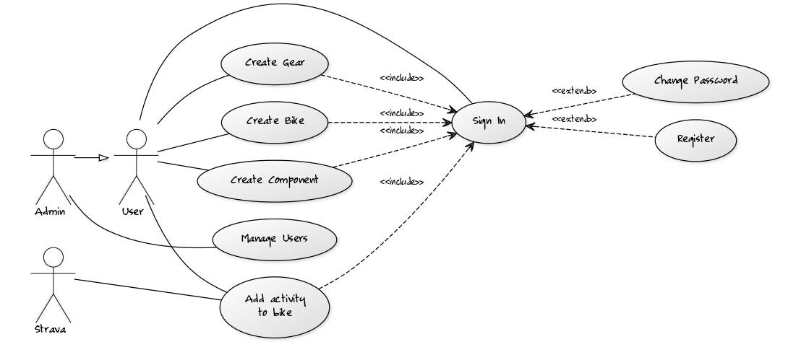

# Project definition

## Description

A siplme web-based app to manage information on bike components and biking gear.

Inspired by the "My Gear" section in [Strava](https://www.strava.com). Where a user is able to define their bikes and the components attached to said bikes. However, the "My Gear" section is very simplistic. It isn't possible to easily swap components (like tires or wheels) on bikes or between bikes. There is also no way to track usage of other gear than components such as cycling shoes or clothes.

In this app the idea is to enable a user to define gear, components and bikes fairly freely and to allow flexible mixing an matching of components and gear.

Initially allow manual addition of bikes, components and gear. And define the relations between all of these. Also allow manual addition of "distance" to bikes that would cascade on to components currently connected to the bike.

Time permitting, add integration to the [Strava rest API](https://strava.github.io/api/) to allow automatic tracking of accrued distance.

Time permitting, add tagging functionality for gear and components to help keep track of component type, usability status and possibly compatibility.

## Environment

The app will be written in [php](http://php.net/manual/en/intro-whatis.php) and deployed on [Heroku](https://www.heroku.com/). Data will be stored in a [postgresql](https://www.postgresql.org/) database provided by Heroku.

The app will be designed to work on all modern browsers (with the possible exception of MS Internet Explorer and Edge) that support javascript.

# Use cases

## Use case diagram

Essentially just all the features described in the [description](dokumentation.md#description) section. Of note may be the fact that use of any feature requires authentication.

## Actors

* User - has a bike and is annoyed with the lacking functionality of the "My Gear" feature on Strava and wants to manage gear and components using the app.
* Admin - a user that is tasked with resetting user passwords as well as all their own gear and component management needs.
* Strava - The Rest API that could potentially provide activities automatically.

## Use case descriptions

The main use cases to start with.

### As a User I want to add a bike to the system

* If not signed in, I sign in using a *user name* and *password* pair.
* Browse to the bikes section.
* Access the "add bike" feature.
* Enter bike details and select "add"

At any point until selecting add, the user can cacel their actions by navigating away from the page or signing out.

### As a User i want to add a component/gear to the system

These are equivalent to adding bikes.

### As a User I want to manage gear (e.g. change the status of a pair of cycling shoes)

* If not signed in, I sign in using a *user name* and *password* pair.
* Browse to the Gear section.
* Select a new status (e.g. retired, in use, not in use) for a piece of gear.

### As a User I want to manage components (e.g. assign tires to a bike)

* If not signed in, I sign in using a *user name* and *password* pair.
* Browse to the Components section.
* Select a new status from a pull-down (e.g. bike1, bike2, retired...) for the component.

Note that assignment to bikes is obviously only available if there are bikes. Else the only available statuses would be retired or available.

### As a User I want to add an activity to a Bike

* If not signed in, I sign in using a *user name* and *password* pair.
* Browse to the Bikes sections.
* Enter magnitude of activity (e.g. 50 km) and select add.
* Activity automatically gets added to bike, gear currently in use and components assigned to the bike.
