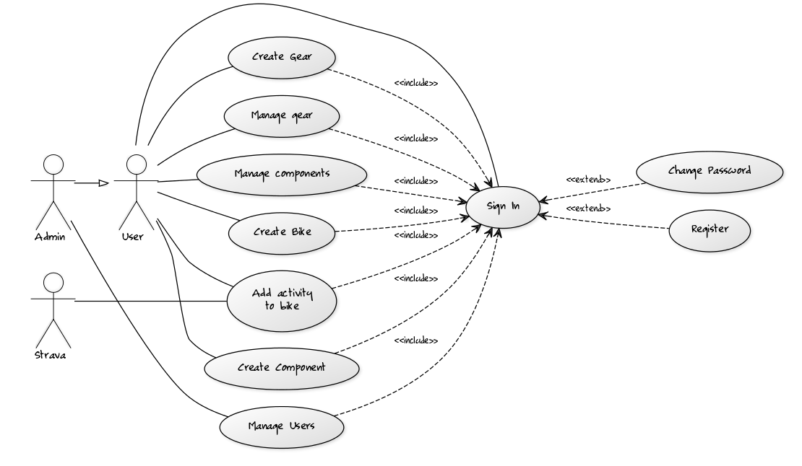

# Project definition

## Description

A siplme web-based app to manage information on bike components and biking gear.

Inspired by the "My Gear" section in [Strava](https://www.strava.com). Where a user is able to define their bikes and the components attached to said bikes. However, the "My Gear" section is very simplistic. It isn't possible to easily swap components (like tires or wheels) on bikes or between bikes. There is also no way to track usage of other gear than components such as cycling shoes or clothes.

In this app the idea is to enable a user to define gear, components and bikes fairly freely and to allow flexible mixing an matching of components and gear.

Initially allow manual addition of bikes, components and gear. And define the relations between all of these. Also allow manual addition of "distance" to bikes that would cascade on to components currently connected to the bike.

Time permitting, add integration to the [Strava rest API](https://strava.github.io/api/) to allow automatic tracking of accrued distance.

Time permitting, add tagging functionality for gear and components to help keep track of component type, usability status and possibly compatibility.

## Use

The app can currently be accessed at [https://bikethinger.herokuapp.com/](https://bikethinger.herokuapp.com/).

For testing you can use **admin** as user name and **root** as password. Note that there is no register feature nor will there ever be. Potentially there will be funtionality to log in to BikeThinger with your Strava credentials.

## Environment

The app will be written in [php](http://php.net/manual/en/intro-whatis.php) and deployed on [Heroku](https://www.heroku.com/). Data will be stored in a [postgresql](https://www.postgresql.org/) database provided by Heroku.

The app will be designed to work on all modern browsers (with the possible exception of MS Internet Explorer and Edge) that support javascript.

# Use cases

## Use case diagram

Essentially just all the features described in the [description](dokumentation.md#description) section. Of note may be the fact that use of any feature requires authentication.

## Actors

* User - has a bike and is annoyed with the lacking functionality of the "My Gear" feature on Strava and wants to manage gear and components using the app.
* Admin - a user that is tasked with resetting user passwords as well as all their own gear and component management needs.
* Strava - The Rest API that could potentially provide activities automatically.

## Use case descriptions

The main use cases to start with.

### As a User I want to add a bike to the system

* If not signed in, I sign in using a *user name* and *password* pair.
* Browse to the bikes section.
* Access the "add bike" feature.
* Enter bike details and select "add"

At any point until selecting add, the user can cacel their actions by navigating away from the page or signing out.

### As a User i want to add a component/gear to the system

These are equivalent to adding bikes.

### As a User I want to manage gear (e.g. change the status of a pair of cycling shoes)

* If not signed in, I sign in using a *user name* and *password* pair.
* Browse to the Gear section.
* Select a new status (e.g. retired, in use, not in use) for a piece of gear.

### As a User I want to manage components (e.g. assign tires to a bike)

* If not signed in, I sign in using a *user name* and *password* pair.
* Browse to the Components section.
* Select a new status from a pull-down (e.g. bike1, bike2, retired...) for the component.

Note that assignment to bikes is obviously only available if there are bikes. Else the only available statuses would be retired or available.

### As a User I want to add an activity to a Bike

* If not signed in, I sign in using a *user name* and *password* pair.
* Browse to the Bikes sections.
* Enter magnitude of activity (e.g. 50 km) and select add.
* Activity automatically gets added to bike, gear currently in use and components assigned to the bike.

# Structure

Note the grey tag box in both diagrams. This is because the details of the implementation are still fuzzy.

## Conceptual structure

### User

The user is the "Owner" of all other items. Stores very little actual data as most data related to the user is stored in other objects. There can be an "unlimited" number of users but these do not interact in any way.

| Attribute | Type                       | Description |
|-----------|----------------------------|-------------|
| user name | string (max 50 characters) | The user name that the user uses to log into the system |
| password  | string (max 50 characters) | The password that the user uses to log into the system |

### Bike

Stores information related to a spesific bike. Typically bound to a given frame. The bike is the attachment point of all components. A user can have any number of bikes and a bike can have any number of attached components

| Attribute   | Type                        | Description |
|-------------|-----------------------------|-------------|
| name        | string (max 50 characters)  | A short preferably unique name given to a bike |
| model       | string (max 400 characters) | A make and model description for the bike. Meant to be a fairly short "at a glance" description   |
| distance    | floating point number       | Total distance the bike has travelled |
| link        | string (max 400 characters) | A link to a manufacturer home page or similar |
| year        | Integer                     | The model or aquisition year of the bike |
| description | string (max 400 characters) | A possibly longer description of the bike |

### Gear

Stores information of a spesific non-bike related piece of gear. Like shoes or a jersey. Typically a rider will choose gear based on weather and type of riding and not necessarily based on the bike. A user may have any amount of gear.

| Attribute   | Type                        | Description |
|-------------|-----------------------------|-------------|
| name        | string (max 50 characters)  | A short preferably unique name given to the piece of gear |
| model       | string (max 400 characters) | A make and model description for the piece of gear. Meant to be a fairly short "at a glance" description   |
| distance    | floating point number       | Total distance the piece of gear has travelled |
| link        | string (max 400 characters) | A link to a manufacturer home page or similar |
| year        | Integer                     | The model or aquisition year of the piece of gear |
| description | string (max 400 characters) | A possibly longer description of the piece of gear |

### Component

Stores information related to a specific component. E.g. break calipers, tires or wheelset. A component may be attached to exactly 1 or 0 bikes at any time. Tho a bike can have any number of components. Components gain distance travelled based on what bike they are attached to.

| Attribute   | Type                        | Description |
|-------------|-----------------------------|-------------|
| name        | string (max 50 characters)  | A short preferably unique name given to a bike |
| model       | string (max 400 characters) | A make and model description for the bike. Meant to be a fairly short "at a glance" description   |
| distance    | floating point number       | Total distance the bike has travelled |
| link        | string (max 400 characters) | A link to a manufacturer home page or similar |
| year        | Integer                     | The model or aquisition year of the bike |
| description | string (max 400 characters) | A possibly longer description of the bike |

### Tag

A user defined tag. A tag may be attached to any bike, component or piece of gear. The idea is that the user can tag any piece of gear as they see fit. **Potentially** the idea is that tags have optional "exclusive" and "mandatory" attributes. I.e. a user can define the "tires" tag to be mandatory and exclusive. Now only one set of tires (with the "tires" tag) can be attached to a bike with the "tires" tag. And potentially a bike won't be "rideable" without "tires" defined. In practice a user could swap tires on a bike simply by defining an other set to be attached, thus automatically detatching the previous set. And also if a user is using the same tires or wheels on multiple bikes, there would be a warning when adding distance to a bike with no tires/wheels installed.

| Attribute   | Type                        | Description |
|-------------|-----------------------------|-------------|
| name        | string (max 50 characters)  | A short name for the tag |
| exclusive   | Boolean                     | A boolean to denote that there can only be one of this type in use at any time |
| required    | Boolean                     | A boolean to denote that there should be at least one of thes present when riding |

## Database structure

